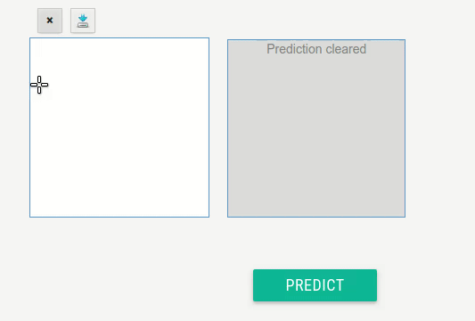

# digit-clasifier
This a naive python implementation of a digit classifier using a convolutional network

The project is uploaded here just to show case my knowledge in machine learning (deep learning).

# A picture worth a thousand words:

